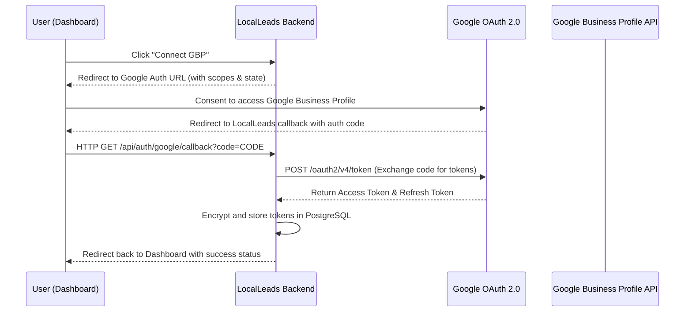

# Google Business Profile OAuth Integration Design

This document details the research, architecture, and design for integrating official Google OAuth 2.0 flows to authorize local review syncing in LocalLeads. This eliminates the need for manual Google Review link configurations or Place IDs.

---

## 1. Objective
Enable users to securely log in with Google, authorize LocalLeads to access their Google Business Profile listings, and automatically fetch/sync local reviews without manual Place ID inputs.

---

## 2. Google OAuth 2.0 Flow Architecture



### Authorization Scope Requirements
To interact with Google Business Profile (formerly Google My Business) reviews, we request:
- `https://www.googleapis.com/auth/business.manage` (Access and manage Google Business Profile listings)
- `openid` & `email` (For verifying account association)

---

## 3. Database Schema Changes

To store the tokens and profile mapping details, we will extend the `users` table with the following columns:

```sql
ALTER TABLE users 
ADD COLUMN gbp_oauth_refresh_token TEXT,
ADD COLUMN gbp_oauth_access_token TEXT,
ADD COLUMN gbp_oauth_token_expires_at TIMESTAMP WITH TIME ZONE,
ADD COLUMN gbp_account_id VARCHAR(255),
ADD COLUMN gbp_location_id VARCHAR(255);
```

> [!IMPORTANT]
> The `gbp_oauth_refresh_token` must be encrypted at rest (e.g., using AES-256-GCM) in the PostgreSQL database to protect users' offline authorization access.

---

## 4. Backend Implementation Plan

### A. Auth URL Initiator (`/api/auth/google/init.js`)
Generates the Google OAuth consent URL and redirects the user:
```javascript
import { google } from 'googleapis';

const oauth2Client = new google.auth.OAuth2(
  process.env.GOOGLE_CLIENT_ID,
  process.env.GOOGLE_CLIENT_SECRET,
  `${process.env.DOMAIN_URL}/api/auth/google/callback`
);

export default async function handler(req, res) {
  // Generate a secure state token to prevent CSRF
  const state = generateSecureState(req); 
  
  const authUrl = oauth2Client.generateAuthUrl({
    access_type: 'offline', // Request refresh token
    scope: ['https://www.googleapis.com/auth/business.manage'],
    state: state,
    prompt: 'consent' // Force consent to guarantee refresh token is returned
  });
  
  res.redirect(authUrl);
}
```

### B. Callback Handler (`/api/auth/google/callback.js`)
Exchanges the code for tokens and saves them:
```javascript
export default async function handler(req, res) {
  const { code, state } = req.query;
  
  // 1. Verify state token against user session (CSRF check)
  verifyState(state, req);
  
  // 2. Exchange code for access & refresh tokens
  const { tokens } = await oauth2Client.getToken(code);
  
  // 3. Save tokens in DB securely
  await query(
    `UPDATE users SET 
      gbp_oauth_refresh_token = $1, 
      gbp_oauth_access_token = $2, 
      gbp_oauth_token_expires_at = $3 
     WHERE id = $4`,
    [encrypt(tokens.refresh_token), tokens.access_token, new Date(tokens.expiry_date), req.userId]
  );
  
  // 4. Auto-discover Account & Location ID
  await discoverAndSaveLocation(req.userId, tokens.access_token);
  
  res.redirect('/dashboard.html?gbp_connected=true');
}
```

---

## 5. Syncing Reviews via GBP API

Once authorized, background cron jobs or manual sync clicks will fetch reviews using the official GBP API endpoint instead of scraping or Places API lookups:

### Request Endpoint
```http
GET https://mybusiness.googleapis.com/v4/accounts/{accountId}/locations/{locationId}/reviews
Authorization: Bearer {accessToken}
```

### Access Token Refresh Logic
```javascript
async function getValidAccessToken(userId) {
  const user = await db.getUser(userId);
  
  // Check if token is expired or expiring in next 5 minutes
  if (new Date() >= new Date(user.gbp_oauth_token_expires_at - 5 * 60 * 1000)) {
    // Refresh access token
    const newTokens = await refreshAccessToken(decrypt(user.gbp_oauth_refresh_token));
    
    await db.updateUserTokens(userId, newTokens.access_token, newTokens.expires_at);
    return newTokens.access_token;
  }
  
  return user.gbp_oauth_access_token;
}
```

---

## 6. Google Verification & Production Readiness
To launch this feature in production, the application must submit for Google API verification via the Google Cloud Console:
1. **OAuth Consent Screen Setup**: Set up privacy policy, user support email, and authorize domains (`localseogen.com`).
2. **Scoping Justification**: Justify requesting `business.manage` scope to synchronize customer reviews for marketing page integrations.
3. **Security Audit**: Comply with Google's API User Data Policy regarding data storage encryption.
