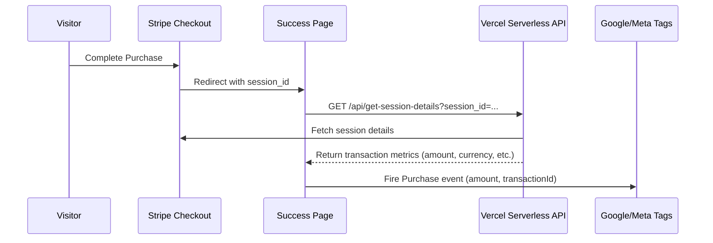

# Google & Meta Ads Conversion Tracking Design

This document details the configuration, implementation, and verification steps for tracking conversions (subscriptions and credit pack purchases) on `localseogen.com` to support Week 9-12 paid acquisition campaigns.

---

## 1. Overview & Architecture

We use a unified client-server tracking pattern to ensure high data accuracy and prevent client-side price tampering or duplicate firings:



## 2. Environment Variables Configuration

Configure the following environment variables in Vercel to activate tracking:

| Variable Name | Description | Example Value |
| :--- | :--- | :--- |
| `OWN_GA_TRACKING_ID` | Google Analytics 4 Measurement ID or Google Ads Tag ID | `AW-1122334455` or `G-XXXXXXX` |
| `OWN_GOOGLE_ADS_CONVERSION_LABEL` | Google Ads Purchase Conversion Label | `xyz_ConversionLabel` |
| `OWN_FB_PIXEL_ID` | Meta (Facebook) Pixel ID | `987654321098` |

---

## 3. Implemented Conversion Events & Parameters

### Google Analytics & Ads Event
- **Event Name**: `purchase` and `conversion`
- **Parameters Passed**:
  ```javascript
  {
      transaction_id: "cs_...", // Stripe checkout session ID
      value: 99.00,             // Actual transaction value in dollars
      currency: "USD",
      items: [{
          item_name: "plan_basic_agency" // or pack_pro, etc.
      }]
  }
  ```

### Meta Pixel Purchase Event
- **Event Name**: `Purchase`
- **Parameters Passed**:
  ```javascript
  {
      value: 99.00,
      currency: "USD",
      content_name: "plan_basic_agency",
      transaction_id: "cs_..."
  }
  ```

---

## 4. Step-by-Step Setup Guide

### Google Ads Integration
1. In the **Google Ads Dashboard**, go to **Tools and Settings** > **Measurement** > **Conversions**.
2. Click **New Conversion Action** > **Website**.
3. Enter `localseogen.com` and scan.
4. Add a conversion action manually with:
   - **Goal**: Purchase
   - **Value**: Use different values for each conversion (tracked dynamically).
   - **Transaction ID**: Enable (this matches our `transaction_id` parameter to deduplicate conversions).
5. Copy the **Conversion ID** (e.g., `AW-1122334455`) and **Conversion Label** (e.g., `xyz_ConversionLabel`).
6. Save these values under `OWN_GA_TRACKING_ID` and `OWN_GOOGLE_ADS_CONVERSION_LABEL` respectively in Vercel.

### Meta Pixel Integration
1. In the **Meta Events Manager**, click **Connect Data Sources** > **Web**.
2. Create or select your Pixel and copy the **Pixel ID** (e.g. `987654321098`).
3. Save this value under `OWN_FB_PIXEL_ID` in Vercel.

---

## 5. Verification & Testing

### Using browser developer tools:
1. Complete a test checkout (using Stripe test card).
2. Upon landing on the success page, verify that the browser sends outbound network requests to:
   - `google-analytics.com/g/collect` with parameters representing `en=purchase`, `ep.transaction_id`, and `ep.value`.
   - `facebook.com/tr/` containing `ev=Purchase`, `cd[value]`, and `cd[transaction_id]`.
